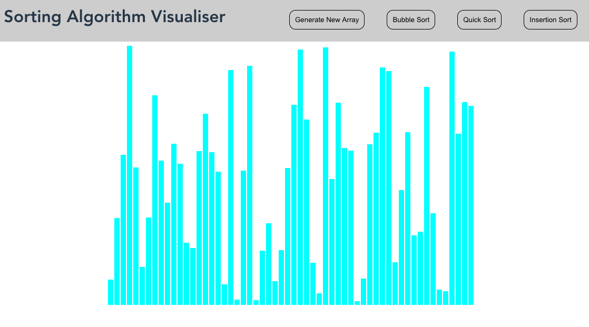

# sorting_visualiser




A small project to display how different sorting algorithms work visually. 


Checklist 
- [x] Header
- [x] main container
- [x] Populate array
- [x] Display array sizes
- [x] Write bubble sort for testing
- [x] Connect algo to UI
- [x] Animate steps 
- [x] Upgrade UI to have main buttons in header
- [x] Insertion sort 
- [x] Quick Sort
- [x] Section with info about easy algo
- [x] Selection Sort
- [ ] Merge Sort
- [ ] Allow user to change Array size 
- [ ] Allow user to change Speed up / Slow time transitions


## Project setup
```
npm install
```

### Compiles and hot-reloads for development
```
npm run serve
```

### Compiles and minifies for production
```
npm run build
```

### Lints and fixes files
```
npm run lint
```

### Customize configuration
See [Configuration Reference](https://cli.vuejs.org/config/).
